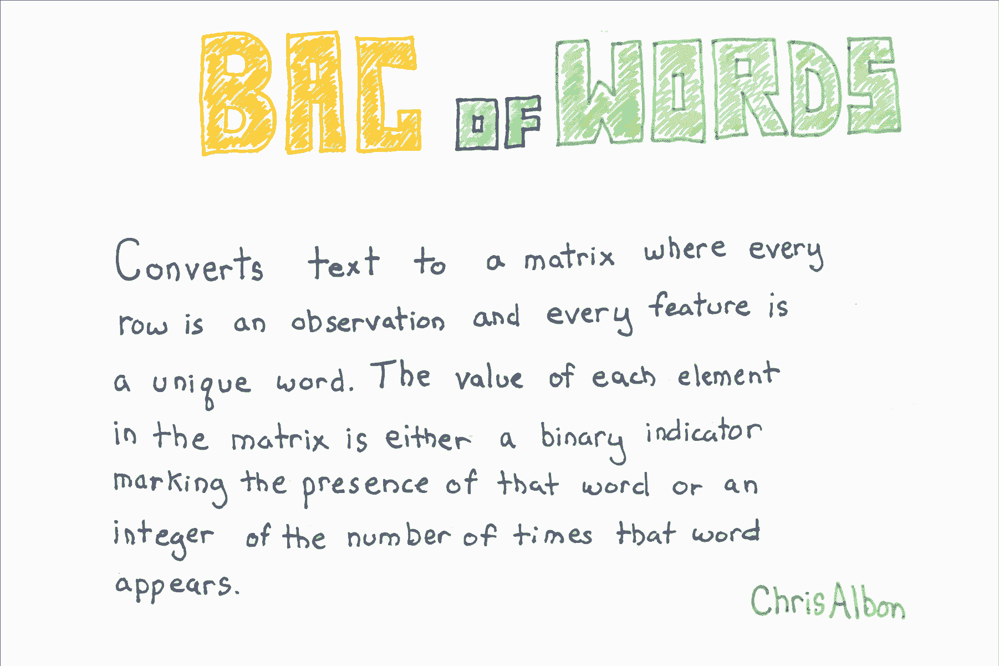
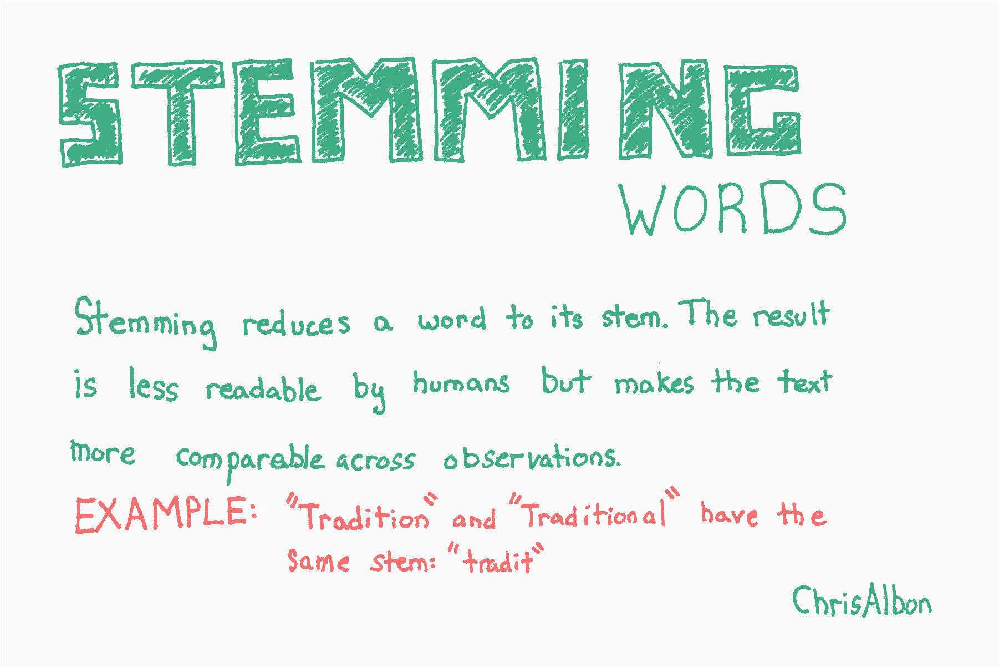
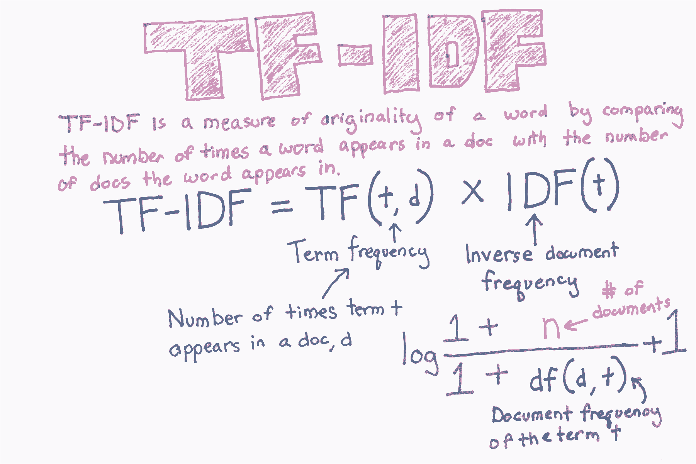

# 五、文本预处理

> 作者：[Chris Albon](https://chrisalbon.com/)
> 
> 译者：[飞龙](https://github.com/)
> 
> 协议：[CC BY-NC-SA 4.0](http://creativecommons.org/licenses/by-nc-sa/4.0/)

# 词袋



```py
# 加载库
import numpy as np
from sklearn.feature_extraction.text import CountVectorizer
import pandas as pd

# 创建文本
text_data = np.array(['I love Brazil. Brazil!',
                      'Sweden is best',
                      'Germany beats both'])

# 创建词袋特征矩阵
count = CountVectorizer()
bag_of_words = count.fit_transform(text_data)

# 展示特征矩阵
bag_of_words.toarray()

'''
array([[0, 0, 0, 2, 0, 0, 1, 0],
       [0, 1, 0, 0, 0, 1, 0, 1],
       [1, 0, 1, 0, 1, 0, 0, 0]], dtype=int64) 
'''

# 获取特征名称
feature_names = count.get_feature_names()

# 查看特征名称
feature_names

# ['beats', 'best', 'both', 'brazil', 'germany', 'is', 'love', 'sweden'] 

# 创建数据帧
pd.DataFrame(bag_of_words.toarray(), columns=feature_names)
```

|  | beats | best | both | brazil | germany | is | love | sweden |
| --- | --- | --- | --- | --- | --- | --- | --- | --- |
| 0 | 0 | 0 | 0 | 2 | 0 | 0 | 1 | 0 |
| 1 | 0 | 1 | 0 | 0 | 0 | 1 | 0 | 1 |
| 2 | 1 | 0 | 1 | 0 | 1 | 0 | 0 | 0 |

# 解析 HTML

```py
# 加载库
from bs4 import BeautifulSoup

# 创建一些 HTML 代码
html = "<div class='full_name'><span style='font-weight:bold'>Masego</span> Azra</div>"

# 解析 html
soup = BeautifulSoup(html, "lxml")

# 寻找带有 "full_name" 类的 <div>，展示文本
soup.find("div", { "class" : "full_name" }).text

# 'Masego Azra' 
```

# 移除标点

```py
# 加载库
import string
import numpy as np

# 创建文本
text_data = ['Hi!!!! I. Love. This. Song....', 
             '10000% Agree!!!! #LoveIT', 
             'Right?!?!']

# 创建函数，使用 string.punctuation 移除所有标点
def remove_punctuation(sentence: str) -> str:
    return sentence.translate(str.maketrans('', '', string.punctuation))

# 应用函数
[remove_punctuation(sentence) for sentence in text_data]

# ['Hi I Love This Song', '10000 Agree LoveIT', 'Right'] 
```

# 移除停止词

```py
# 加载库
from nltk.corpus import stopwords

# 你第一次需要下载停止词的集合
import nltk
nltk.download('stopwords')

'''
[nltk_data] Downloading package stopwords to
[nltk_data]     /Users/chrisalbon/nltk_data...
[nltk_data]   Package stopwords is already up-to-date!

True 
'''

# 创建单词标记
tokenized_words = ['i', 'am', 'going', 'to', 'go', 'to', 'the', 'store', 'and', 'park']

# 加载停止词
stop_words = stopwords.words('english')

# 展示停止词
stop_words[:5]

# ['i', 'me', 'my', 'myself', 'we'] 

# 移除停止词
[word for word in tokenized_words if word not in stop_words]

# ['going', 'go', 'store', 'park'] 
```

# 替换字符

```py
# 导入库
import re

# 创建文本
text_data = ['Interrobang. By Aishwarya Henriette',
             'Parking And Going. By Karl Gautier',
             'Today Is The night. By Jarek Prakash']

# 移除句号
remove_periods = [string.replace('.', '') for string in text_data]

# 展示文本
remove_periods

'''
['Interrobang By Aishwarya Henriette',
 'Parking And Going By Karl Gautier',
 'Today Is The night By Jarek Prakash'] 
'''

# 创建函数
def replace_letters_with_X(string: str) -> str:
    return re.sub(r'[a-zA-Z]', 'X', string)

# 应用函数
[replace_letters_with_X(string) for string in remove_periods]

'''
['XXXXXXXXXXX XX XXXXXXXXX XXXXXXXXX',
 'XXXXXXX XXX XXXXX XX XXXX XXXXXXX',
 'XXXXX XX XXX XXXXX XX XXXXX XXXXXXX'] 
'''
```

# 词干提取



```py
# 加载库
from nltk.stem.porter import PorterStemmer

# 创建单词标记
tokenized_words = ['i', 'am', 'humbled', 'by', 'this', 'traditional', 'meeting']
```

词干提取通过识别和删除词缀（例如动名词）同时保持词的根本意义，将词语简化为词干。 NLTK 的`PorterStemmer`实现了广泛使用的 Porter 词干算法。

```py
# 创建提取器
porter = PorterStemmer()

# 应用提取器
[porter.stem(word) for word in tokenized_words]

# ['i', 'am', 'humbl', 'by', 'thi', 'tradit', 'meet'] 
```

# 移除空白

```py
# 创建文本
text_data = ['   Interrobang. By Aishwarya Henriette     ',
             'Parking And Going. By Karl Gautier',
             '    Today Is The night. By Jarek Prakash   ']

# 移除空白
strip_whitespace = [string.strip() for string in text_data]

# 展示文本
strip_whitespace

'''
['Interrobang. By Aishwarya Henriette',
 'Parking And Going. By Karl Gautier',
 'Today Is The night. By Jarek Prakash'] 
'''
```

# 词性标签

```py
# 加载库
from nltk import pos_tag
from nltk import word_tokenize

# 创建文本
text_data = "Chris loved outdoor running"

# 使用预训练的词性标注器
text_tagged = pos_tag(word_tokenize(text_data))

# 展示词性
text_tagged

# [('Chris', 'NNP'), ('loved', 'VBD'), ('outdoor', 'RP'), ('running', 'VBG')] 
```

输出是一个元组列表，包含单词和词性的标记。 NLTK 使用 Penn Treebank 词性标签。

| 标签 | 词性 |
| --- | --- |
| NNP | 专有名词，单数 |
| NN | 名词，单数或集体 |
| RB | 副词 |
| VBD | 动词，过去式 |
| VBG | 动词，动名词或现在分词 |
| JJ | 形容词 |
| PRP | 人称代词 |

# TF-IDF



```py
# 加载库
import numpy as np
from sklearn.feature_extraction.text import TfidfVectorizer
import pandas as pd

# 创建文本
text_data = np.array(['I love Brazil. Brazil!',
                      'Sweden is best',
                      'Germany beats both'])

# 创建 tf-idf 特征矩阵
tfidf = TfidfVectorizer()
feature_matrix = tfidf.fit_transform(text_data)

# 展示 tf-idf 特征矩阵
feature_matrix.toarray()

'''
array([[ 0.        ,  0.        ,  0.        ,  0.89442719,  0.        ,
         0.        ,  0.4472136 ,  0.        ],
       [ 0.        ,  0.57735027,  0.        ,  0.        ,  0.        ,
         0.57735027,  0.        ,  0.57735027],
       [ 0.57735027,  0.        ,  0.57735027,  0.        ,  0.57735027,
         0.        ,  0.        ,  0.        ]]) 
'''

# 展示 tf-idf 特征矩阵
tfidf.get_feature_names()

# ['beats', 'best', 'both', 'brazil', 'germany', 'is', 'love', 'sweden'] 

# 创建数据帧
pd.DataFrame(feature_matrix.toarray(), columns=tfidf.get_feature_names())
```

|  | beats | best | both | brazil | germany | is | love | sweden |
| --- | --- | --- | --- | --- | --- | --- | --- | --- |
| 0 | 0.00000 | 0.00000 | 0.00000 | 0.894427 | 0.00000 | 0.00000 | 0.447214 | 0.00000 |
| 1 | 0.00000 | 0.57735 | 0.00000 | 0.000000 | 0.00000 | 0.57735 | 0.000000 | 0.57735 |
| 2 | 0.57735 | 0.00000 | 0.57735 | 0.000000 | 0.57735 | 0.00000 | 0.000000 | 0.00000 |

# 文本分词

```py
# 加载库
from nltk.tokenize import word_tokenize, sent_tokenize

# 创建文本
string = "The science of today is the technology of tomorrow. Tomorrow is today."

# 对文本分词
word_tokenize(string)

'''
['The',
 'science',
 'of',
 'today',
 'is',
 'the',
 'technology',
 'of',
 'tomorrow',
 '.',
 'Tomorrow',
 'is',
 'today',
 '.'] 
'''

# 对句子分词
sent_tokenize(string)

# ['The science of today is the technology of tomorrow.', 'Tomorrow is today.'] 
```
